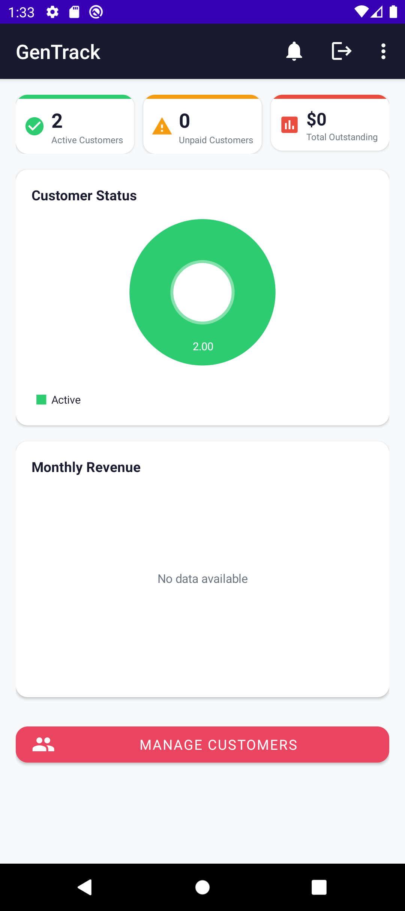
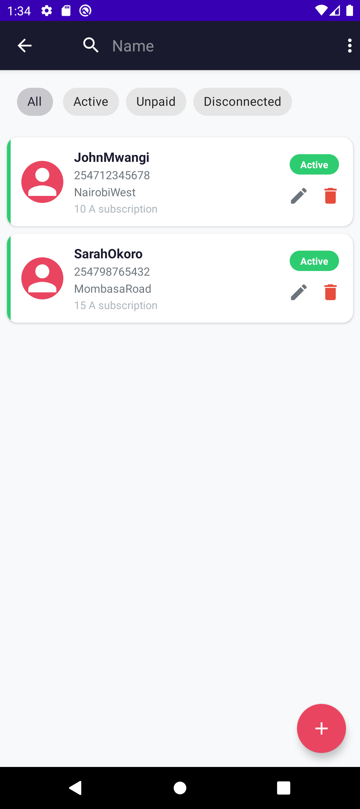
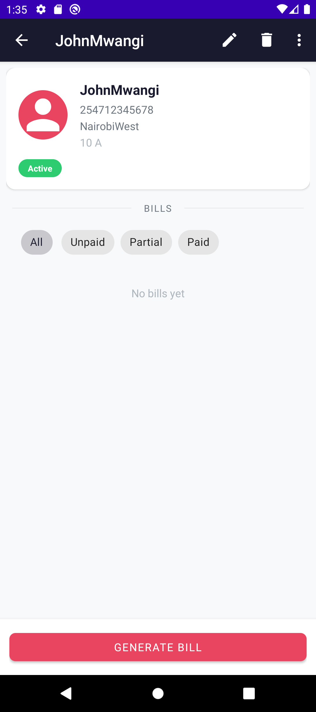

# GenTrack

Android app for managing a small power-generator utility business — customers, metered/tiered billing, payments, invoicing, and admin analytics. Single-admin, Firebase-authenticated, backed by a PHP/MySQL REST API with local-first SQLite storage and offline sync.

## Screenshots

| Dashboard | Customer List | Customer Detail |
|---|---|---|
|  |  |  |

## Features

- Customer management (CRUD, status tracking, search/filter, photo upload)
- Dual billing engine: tiered flat-rate by amperage class, and metered base-fee + kWh consumption billing
- Single and batch bill generation with balance roll-forward
- Payment recording with partial payments and auto debt-carry settlement
- PDF invoice generation and sharing (SMS/WhatsApp/email)
- Dashboard analytics (customer status pie chart, monthly revenue bar chart)
- Admin-configurable remote pricing
- Firestore-backed announcements
- Offline-first sync with retry queue
- Background notifications for overdue bills (WorkManager)
- Firebase Authentication

## Tech stack

- **Language:** Java (no Kotlin), minSdk 26, compileSdk 36
- **Architecture:** hand-rolled layered architecture — Activities (UI) → Services (business logic) → DatabaseHandler/DAOs (SQL). No MVVM/ViewModel/LiveData/Room/Retrofit; async via a single-thread `ExecutorService` + main-thread callbacks.
- **Networking:** Volley, against a PHP/MySQL REST backend
- **Auth / cloud:** Firebase Authentication, Firestore (announcements), Firebase Storage (photos)
- **Local storage:** SQLiteOpenHelper with offline sync queue
- **Background work:** WorkManager
- **Charts:** MPAndroidChart
- **PDF:** iText7
- **Images:** Glide
- **UI:** Material Components
